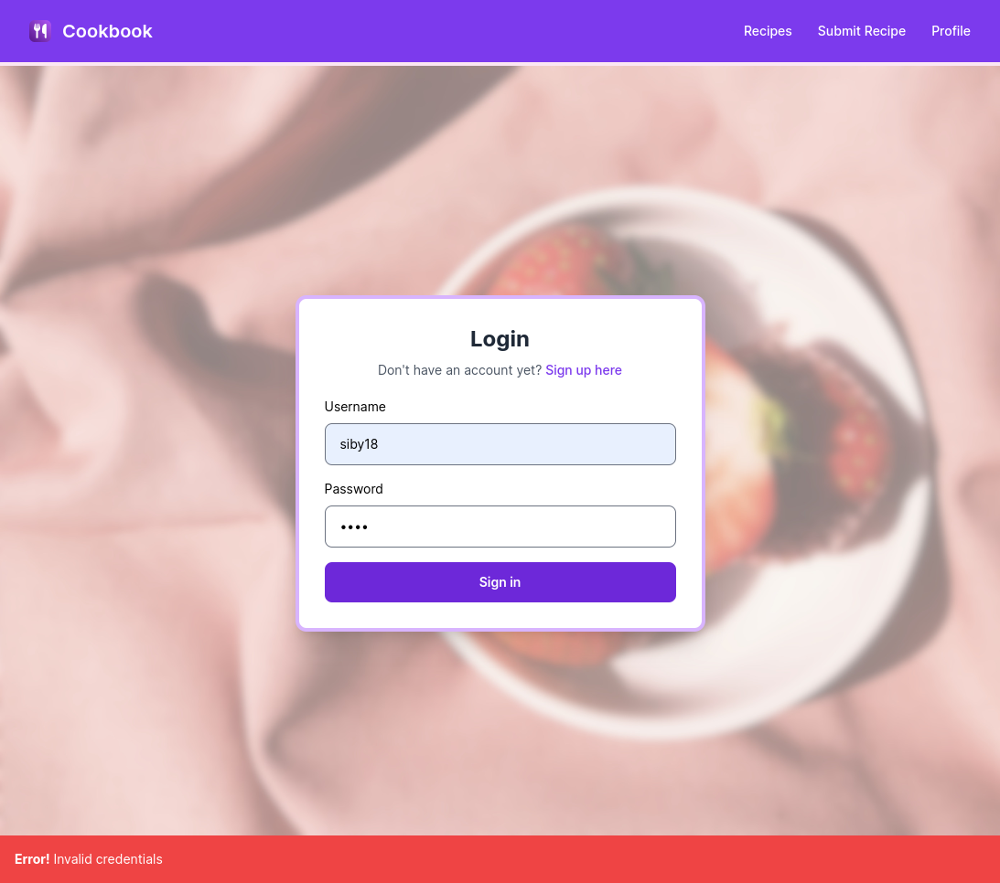
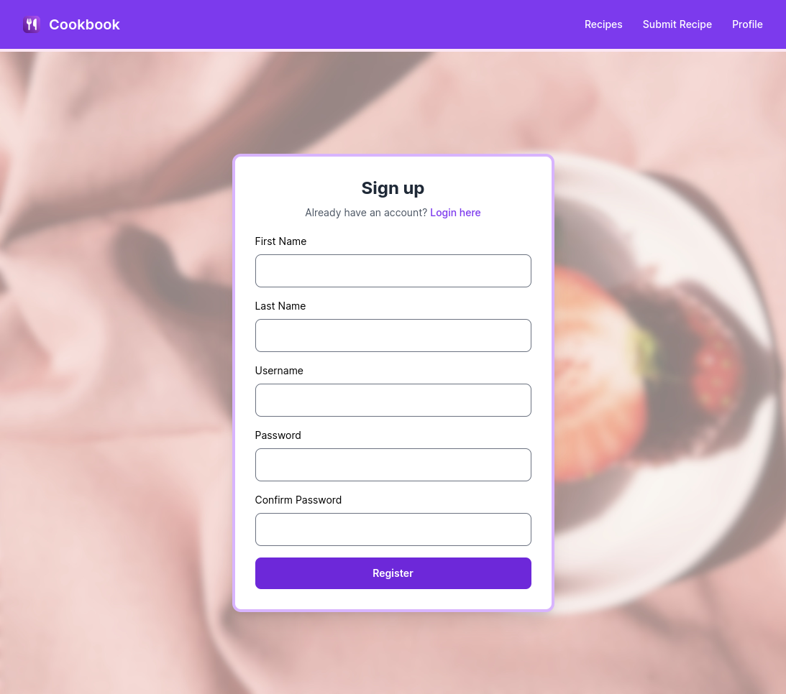
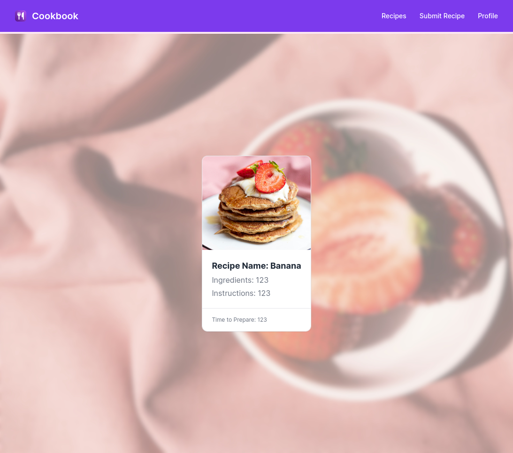
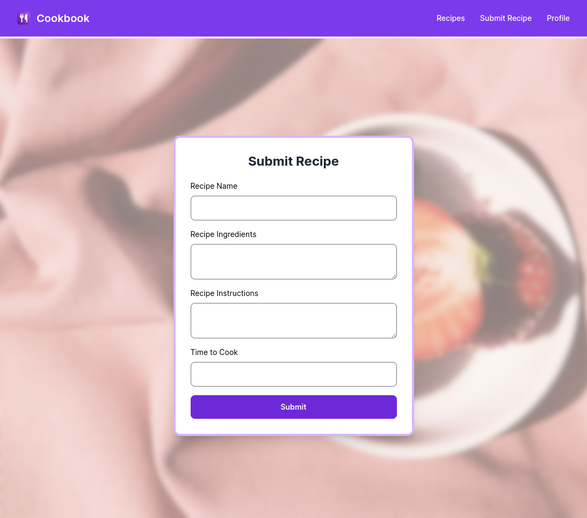

# SachinthaSenanayake_145
## Full (MERN) Stack Application

### Features

- Welcome to the "Cookbook" MERN Application
    - Utilizes ExpressJS, Bcrypt, JWTs, .ENV files, CORS, Mongoose and Typescript in the **Backend**.
    - Utilized React w/ React Router via Vite, TailwindCSS, Axios, Preline UI Component Library & Typescript in the **Frontend**. 
    
- You can:
    - Create an account on the Cookbook app
    - You can login to existing accounts
    - You can add recipes added to the app
    - You can view other recipes added to the app

### How do I run this app?

1. Clone this repository
2. Install node dependancies in `frontend/` and `backend/` folders via `npm i`
3. Run `npm run dev` in the `frontend/` folder to start the **Vite Server**.
4. Run `npm run dev` in the `backend/` folder to start the **NodeJS Server**.
5. Access the app via the provided *localhost URL*

- 🚨 **I have provided the .env files in the repo since this is for exam purposes, although I understand this is not recommended in a production setting**
- 🚨 **If you get a "token error" the first time you sign in - please clear local storage and refresh the page**.

### Screenshots

- Login Page (w/ User-Friendly Errors)

- Signup Page (w/ User)

- Recipe List Page

- Submit Recipe Page

